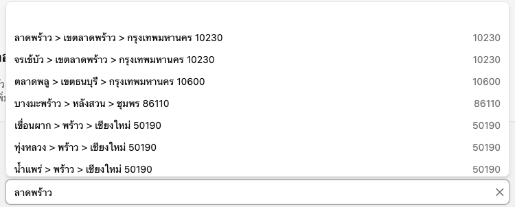
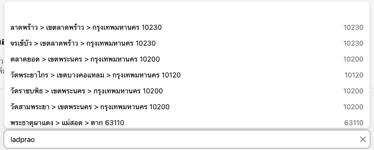

# react-thaizip

[](https://www.npmjs.com/package/react-thaizip)
[](https://www.npmjs.com/package/react-thaizip)
[](https://github.com/naay99999/react-thai-zip/blob/main/LICENSE)

A CLI that scaffolds ready-to-use Thai address React components — powered by [`thaizip`](https://www.npmjs.com/package/thaizip) — directly into your project, shadcn/ui-style.

📚 **[Documentation and live component demos](https://react-thai-zip.vercel.app)**

| Thai input | English input (romanization alias) |
|---|---|
|  |  |

## Quick start

```bash
npx react-thaizip init
npx react-thaizip add autocomplete
```

- `init` detects your project structure, package manager, and Tailwind version, then writes a `thaizip.config.json` used by `add`.
- `add autocomplete` installs `thaizip`, `@base-ui/react`, `clsx`, and `tailwind-merge`, then scaffolds 3 files into your project: the component plus its two shared dependencies (`lib/utils.ts` and `hooks/use-thai-address-index.ts`).

```tsx
import { ThaiAddressAutocomplete } from '@/components/thai-address-autocomplete'

<ThaiAddressAutocomplete
  name="address"
  onValueChange={(address) => console.log(address)}
/>
```

> **Prerequisite:** your project needs Tailwind CSS (v3 or v4) already installed. `init` detects it but doesn't install it for you — if none is found, it prints a pointer to the [Tailwind install docs](https://tailwindcss.com/docs/installation) and exits.

## Components

- **`autocomplete`** (`ThaiAddressAutocomplete`) — free-text address search built on [Base UI](https://base-ui.com/react/components/combobox)'s `Combobox`.
- **`cascade-select`** (`ThaiAddressCascadeSelect`) — province > district > sub-district cascade built on [Base UI](https://base-ui.com/react/components/select)'s `Select` (×3).
- **`address-form`** (`ThaiAddressForm`) — house number + optional moo/soi/street free text, layered directly on top of `ThaiAddressCascadeSelect` (embedded by file, not by npm import).
- **`address-display`** (`ThaiAddressDisplay`) — read-only address renderer; no `onValueChange`/`name`/hidden inputs, just formats a `ThaiAddressDisplayValue` you hand it.

```bash
npx react-thaizip add                         # interactive multiselect
npx react-thaizip add autocomplete            # or: ThaiAddressAutocomplete
npx react-thaizip add cascade-select          # or: ThaiAddressCascadeSelect
npx react-thaizip add address-form            # or: ThaiAddressForm
npx react-thaizip add address-display         # or: ThaiAddressDisplay
npx react-thaizip add autocomplete cascade-select  # multiple at once
```

Each `add` also requires `thaizip` >= 0.7.0 (the version that added the cascade/enumeration API and bilingual labels the templates rely on) — an older installed version makes `add` exit without writing files.

Both components share the same shape:

- Controlled or uncontrolled `value` / `defaultValue` / `onValueChange` (`ResolvedThaiAddress | null`)
- `name` — renders 4 hidden inputs for plain `<form>` submission: `${name}-subdistrict`, `-district`, `-province`, `-zipcode`
- `locale` (`'th'` default or `'en'`) and a `texts` prop to override any label/status message
- `disabled` / `required` / `onBlur` / `onError`, plus per-part `className` slots
- A forwarded `ref`

<details>
<summary><strong>Full prop reference</strong></summary>

### `ThaiAddressAutocomplete`

| Prop | Purpose |
|---|---|
| `value` / `defaultValue` / `onValueChange` | Controlled or uncontrolled `ResolvedThaiAddress \| null` selection |
| `name` | When set, renders 4 hidden inputs: `${name}-subdistrict`, `-district`, `-province`, `-zipcode` |
| `locale` | `'th'` (default) or `'en'` — drives suggestion labels and default `texts` |
| `texts` | `Partial<Texts>` — override any subset of the default labels/status messages |
| `limit` / `debounce` / `threshold` | Passed through to the underlying search hook |
| `disabled` / `required` / `onBlur` / `onError` | Standard field wiring; `onError` fires if the bundled address index fails to load |
| `className` / `inputClassName` / `popupClassName` / `itemClassName` | Class-name slots for the wrapper, input, popup, and each suggestion item |
| `ref` | Forwarded to the underlying `<input>` |

### `ThaiAddressCascadeSelect`

| Prop | Purpose |
|---|---|
| `value` / `defaultValue` / `onValueChange` | Controlled or uncontrolled `ResolvedThaiAddress \| null` selection. Changing a parent select in a way that invalidates a full selection fires `onValueChange(null)` and resets the downstream selects |
| `name` | When set, renders 4 hidden inputs: `${name}-subdistrict`, `-district`, `-province`, `-zipcode` |
| `locale` | `'th'` (default) or `'en'` — drives option labels and default `texts` |
| `texts` | `Partial<Texts>` — override any subset of the default labels/status messages |
| `disabled` / `required` / `onBlur` / `onError` / `aria-invalid` | Standard field wiring; `onError` fires if the bundled address index fails to load |
| `className` / `labelClassName` / `triggerClassName` / `popupClassName` / `itemClassName` | Class-name slots for the wrapper, labels, each select trigger, popup, and each option item |
| `ref` | Forwarded to the province select's trigger button |

### `ThaiAddressForm`

| Prop | Purpose |
|---|---|
| `value` / `defaultValue` / `onValueChange` | Controlled or uncontrolled `FullThaiAddress \| null` — a `ResolvedThaiAddress` plus `houseNo` (required) and optional `moo`/`soi`/`street`. Fires only when `houseNo` is non-blank and the embedded cascade has a full resolution; otherwise the value is `null` |
| `name` | When set, forwarded to the embedded `ThaiAddressCascadeSelect` (its own 4 hidden inputs) plus renders 4 more of its own: `${name}-houseno`, `-moo`, `-soi`, `-street` |
| `locale` | `'th'` (default) or `'en'` — drives this component's own labels and the embedded cascade's |
| `texts` | `Partial<ThaiAddressFormTexts>` — override the house-number/moo/soi/street labels and placeholders |
| `cascadeTexts` | `Partial<Texts>` forwarded to the embedded `ThaiAddressCascadeSelect`'s own `texts` prop |
| `disabled` / `required` / `onBlur` / `onError` | Standard field wiring; `onBlur` fires on the house-number input specifically; `onError` fires if the bundled address index fails to load (delegated to the embedded cascade) |
| `className` / `labelClassName` / `inputClassName` / `triggerClassName` / `popupClassName` / `itemClassName` | Class-name slots for the wrapper, labels, the 4 text inputs, and the embedded cascade's own trigger/popup/item slots |
| `ref` | Forwarded to the house-number `<input>` |

### `ThaiAddressDisplay`

| Prop | Purpose |
|---|---|
| `value` | `ThaiAddressDisplayValue \| null` — a `ResolvedThaiAddress` plus optional `houseNo`/`moo`/`soi`/`street`. `null` renders `emptyText` |
| `locale` | `'th'` (default) or `'en'` — drives the locality label and the default `emptyText` |
| `mode` | `'single-line'` (default, street + locality joined with `', '`) or `'multi-line'` (two `<span>` rows) |
| `emptyText` | Overrides the default "no address" text shown when `value` is `null` |
| `className` | Class name for the root `<address>` element |
| `lineClassName` | Class name for each row's `<span>` in `'multi-line'` mode |
| `ref` | Forwarded to the root `<address>` element |

</details>

## Customizing labels (`texts` prop)

Every generated component ships with Thai default labels (`locale` defaults to `'th'`); pass `locale="en"` to switch to the built-in English set. The optional `texts` prop overrides any subset of the active set:

```tsx
<ThaiAddressCascadeSelect
  locale="en"
  texts={{
    provinceLabel: 'Province',
    districtLabel: 'District',
    subdistrictLabel: 'Sub-district',
    zipLabel: 'Postal code',
  }}
/>
```

`texts` is `Partial<Texts>`, so you only need to supply the keys you want to change — anything you omit falls back to the locale's default. Each component exports its own `Texts` type covering its labels, placeholders, and status messages (e.g. `loadingText`, `errorText`).

## CLI flags

```
npx react-thaizip init [--yes]
npx react-thaizip add [component...] [--yes] [--overwrite]
npx react-thaizip --help
npx react-thaizip --version
```

- `--yes`, `-y` — skip confirmation prompts (`init` and `add`)
- `--overwrite` — overwrite existing files without prompting (`add` only), including `<libDir>/utils.ts` and `<hooksDir>/use-thai-address-index.ts`, which are otherwise never touched once they exist
- `--help`, `-h` — print usage and the list of available components
- `--version`, `-v` — print the CLI's own version
- `init --help` / `add --help` — print command-scoped usage (`add --help` includes the component list)

## Contributing: deploying the documentation site

Deploy `apps/docs` as a separate Vercel project. Set its **Root Directory** to `apps/docs` and use Node.js 22 or newer. The docs app imports the component templates from `templates/react/ts/` directly, and those imports (`thaizip`, `clsx`, `tailwind-merge`, `@base-ui/react`) resolve against this repo's own `node_modules`, not just `apps/docs/node_modules` — `apps/docs/vercel.json` overrides the Install Command to install both. Keep Vercel's default `npm run build` command. The docs app owns its own `package-lock.json` and its build uses Webpack for compatibility with the Fumadocs MDX pipeline.
